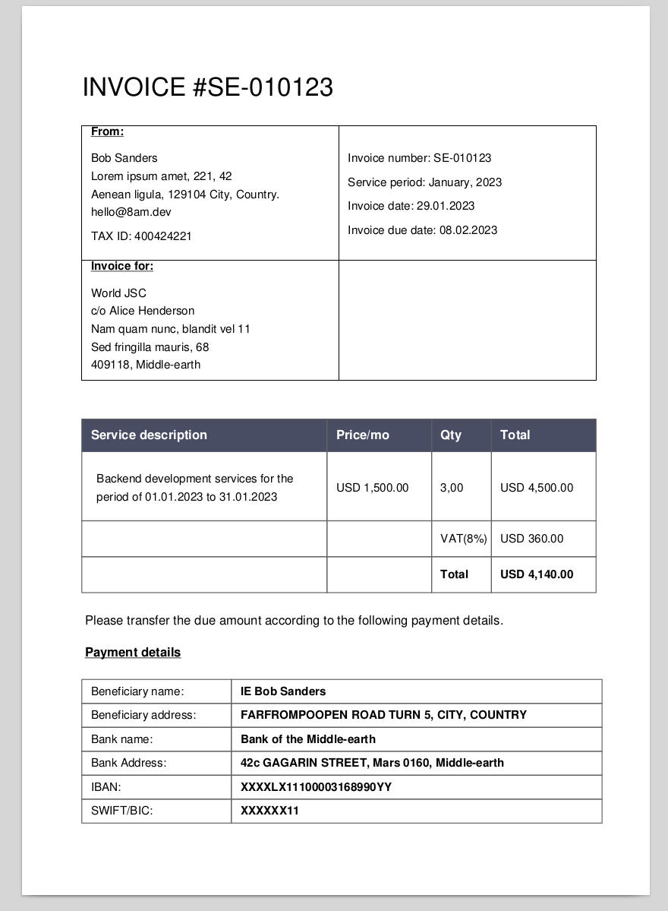

# Invoice-generator

Invoice-generator is a simple tool for generating invoices in automatic mode.
There is no need to fill out anything every month. You do it once and that's it.

It can be used for several projects at once, just create different configuration
files and put them in different folders where you want to save invoices.

## Installation

```shell
go install github.com/coffeewasmyidea/invoice-generator@latest
```

You also need to download the `invoice-generator.toml` configuration file for
each project for which you want to generate invoices. 

```shell
curl -o /path/to/invoice-folder/invoice-generator.toml https://raw.githubusercontent.com/coffeewasmyidea/invoice-generator/main/invoice-generator.toml.example
```

## General usage

You just need to run:

```shell
invoice-generator g
```

the in folders where `invoice-generator.toml` is present, and you will receive
an invoice for the current month.

In addition, you can pass the date (month.year) of the desired service period as
an argument as follows:

```shell
invoice-generator g 10.2023
```

Invoice-generator will generate an invoice for the current period with the
correct dates for all presented fields.

```shell
$ ./invoice-generator
NAME:
   invoice-generator - A new cli application

USAGE:
   invoice-generator [global options] command [command options] [arguments...]

COMMANDS:
   generate, g  Generate a new invoice based on invoice-generator.toml information and current date.
                Alternatively, you can pass the date (month.year) of the desired service period as anargument like this ./invoice-generator g 10.2023
   help, h      Shows a list of commands or help for one command

GLOBAL OPTIONS:
   --help, -h  show help
```

### Invoice example:

<div align="center">

</div>

## Requiremrnts

There are no requirements and additional dependencies it will work on any OS.
